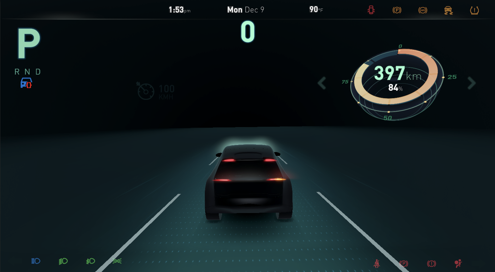
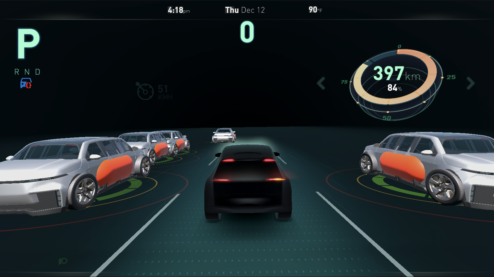
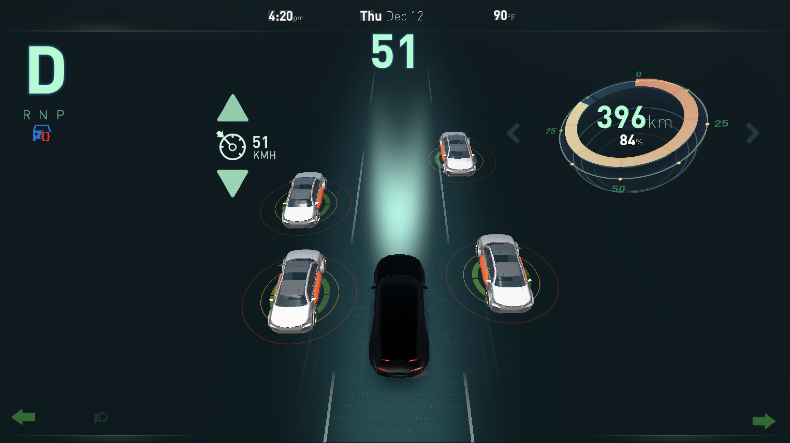
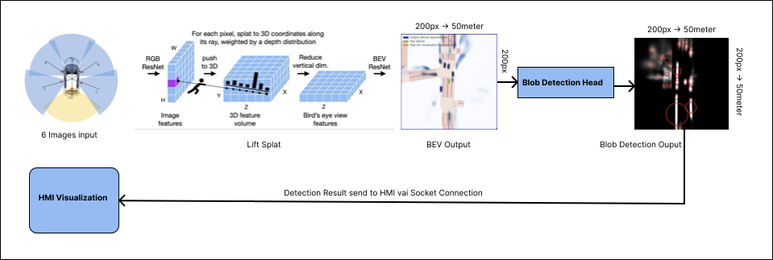
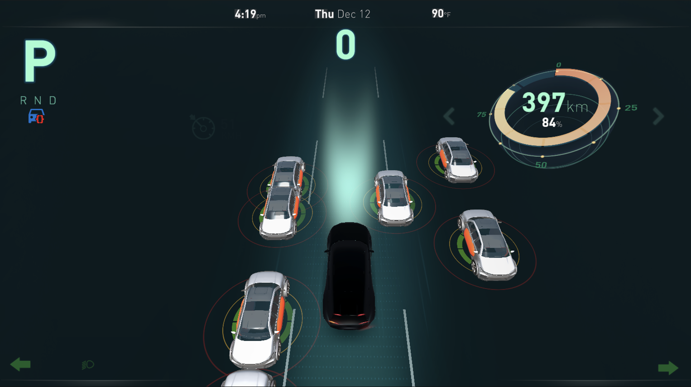

# Lift-Splat-Blob (LSB): A Hybrid Approach for Real-Time Vehicle Detection in ADAS

## Overview
The **Lift-Splat-Blob (LSB)** method is a novel hybrid approach for vehicle detection in Advanced Driver Assistance Systems (ADAS). This method combines the powerful Bird’s Eye View (BEV) transformation from the **Lift-Splat-Shoot (LSS)** method with an optimized blob detection algorithm, enabling efficient real-time inference for ADAS applications.

This repository includes the implementation of the LSB method and its proof-of-concept ADAS system, featuring:
- **High-speed inference**: Achieves 56 FPS for BEV transformation from six images and up to 774 FPS (average) for blob detection.

- **Intuitive Human-Machine Interface (HMI)**: Developed in Unity 3D, providing a user-friendly visualization of vehicle detection results. [Unity 3D HMI Repository](https://github.com/lienghongky/cmx-hmi)

## Features
- **BEV Transformation**: Generates a top-down view of the scene using multi-camera input.
- **Blob Detection**: Efficiently identifies vehicles in the BEV representation.
- **Unity 3D HMI**: Offers a real-time visual interface for ADAS users.

## GIF Demonstrations

### Real-Time Vehicle Detection
Below are some GIFs demonstrating the real-time vehicle detection capabilities of the LSB method:

| {:width="30%"} | {:width="30%"} | {:width="30%"} |
|:------------------------------:|:----------------------------------------:|:-----------------------------------:|
| **All 6 Cameras are feeded to model** | **Disconnected Front and back Cam** | **Disconnected both Right Cam** |

### HMI Visualizations
Below are some images showcasing the Human-Machine Interface (HMI) developed in Unity 3D:


|  |  |
|:-------------------------------------:|:-------------------------------------:|
| **HMI Parking Mode**               | **HMI Detecting Vehicles**               |


## Overall Architecture

The LSB method integrates several components to achieve real-time vehicle detection:

1. **Multi-Camera Input**: Captures images from multiple cameras mounted on the vehicle.
2. **BEV Transformation Module**: Converts the multi-camera images into a unified Bird’s Eye View representation.
3. **Blob Detection Module**: Identifies and tracks vehicles within the BEV representation.
4. **HMI Module**: Visualizes the detection results in real-time using Unity 3D.

The following diagram illustrates the overall architecture of the LSB method:



## Repository Structure
- **`scr/`**: Python implementation of the LSB backbone.
- **`data/`**: Nuscen
- **`imgs/`**: doc image
- **`models/`**: models
- **`visualization/`**:  visualization.
- **`README.md`**: Project documentation.

## Quick Start
### Prerequisites
- Python >= 3.8
- Unity 2021 or later
- NVIDIA GPU with CUDA support (recommended for optimal performance)

### Installation
1. Clone this repository:
   ```bash
   git clone https://github.com/lienghongky/cmx-lsb.git
   cd cmx-lsb
   ```

2. Create Conda env:
   ```bash
    conda env create -f environment.yml -n lsb
    conda activate lsb
   ```

3. Download the pre-trained model and place it in the `checkpoints/` directory:
   [Pre-trained Model](https://drive.google.com/file/d/1bsUYveW_eOqa4lglryyGQNeC4fyQWvQQ/view?usp=sharing)

4. Set up Unity 3D HMI by cloning the Unity project:
   ```bash
   git clone https://github.com/lienghongky/cmx-hmi.git
   ```
   Open the project in Unity and ensure all dependencies are resolved.

## Demo
### Downloading the Mini Dataset from nuScenes
1. Register and download the nuScenes mini dataset from the [nuScenes website](https://www.nuscenes.org/download).
2. Extract the downloaded dataset and place it in the `datas/mini` directory.
3. Ensure the directory structure is as follows:
    ```
    datas/
      └── mini/
            ├── samples/
            ├── sweeps/
            ├── maps/
            └── v1.0-mini/
    ```
### Running the BEV Transformation + Blob Detection
1. Prepare a set of six camera images.
2. Run the LSB backbone:
   ```bash
   python main.py start_server  mini --modelf=models/model525000.pt --dataroot=datas --map_folder=datas/mini
 
   ```
3. Visualize the output:
   ```bash
   python main.py viz_model_preds_no_mlt mini --modelf=models/model525000.pt --dataroot=datas --map_folder=datas/mini
   ```

### Using the Unity 3D HMI
1. Open the Unity project from `cmx-hmi` in Unity Editor.
2. Run the HMI to see real-time vehicle detection visualizations.

## Results
### Inference Speed
- BEV Transformation: **56 FPS** (6 images)
- Blob Detection: **497-1698 FPS** (average: 774 FPS)

### Detection Accuracy
- Achieves robust vehicle detection in diverse scenarios with real-time performance.

### Screenshots
#### Unity 3D HMI Visualization


#### BEV Output with Blob Detection


## Citation
If you find this work useful, please consider citing the original *Lift-Splat-Shoot* paper:
```
@inproceedings{philion2020lift,
    title={Lift, Splat, Shoot: Encoding Images From Arbitrary Camera Rigs by Implicitly Unprojecting to 3D},
    author={Jonah Philion and Sanja Fidler},
    booktitle={Proceedings of the European Conference on Computer Vision},
    year={2020},
}
```

## Acknowledgments
This project builds upon *Lift-Splat-Shoot (LSS)* by Jonah Philion and Sanja Fidler (ECCV 2020). Special thanks to the NVIDIA Research team for their foundational work in BEV transformation and multi-camera perception. The Unity 3D HMI was developed to enhance the usability and visualization of LSB for ADAS applications.

## License
This project is released under the NVIDIA Source Code License. See the `LICENSE` file for details.

